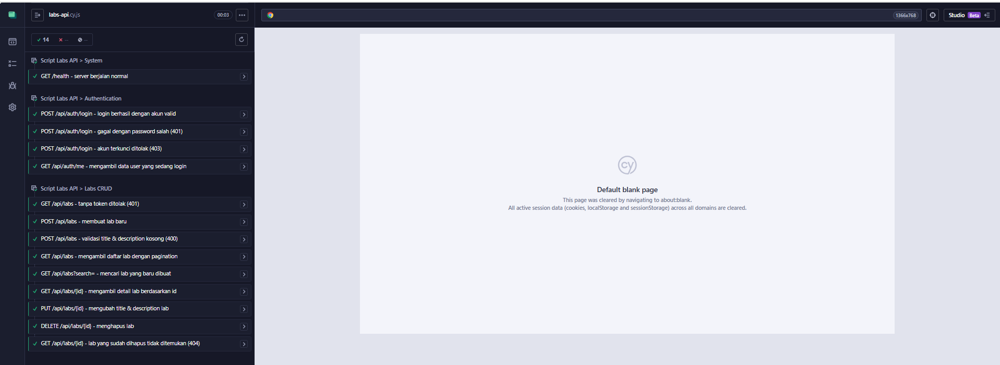
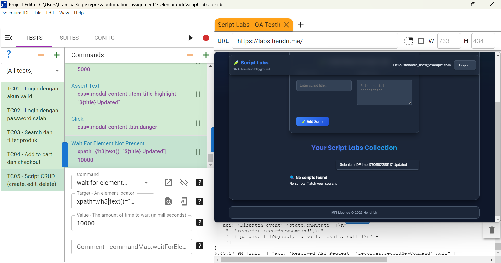
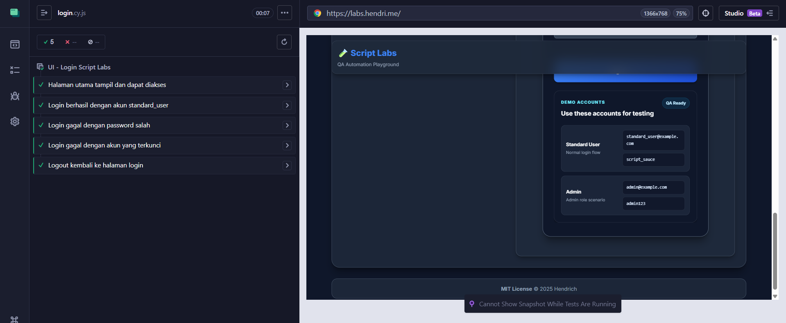
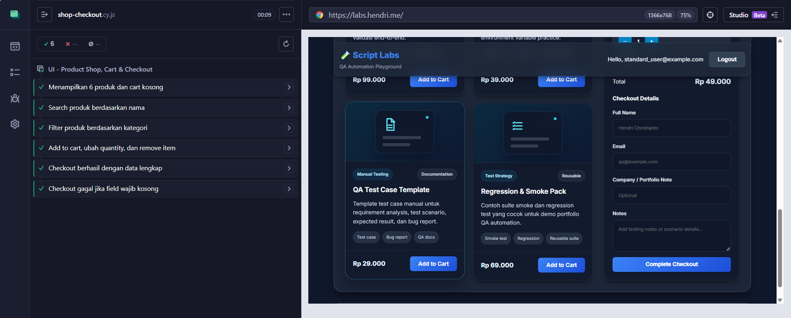
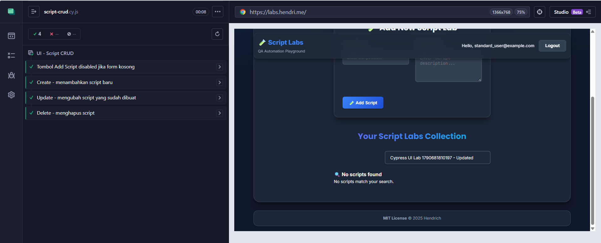

# Assignment 4 - Automation Testing API & UI (Cypress + Selenium IDE)

Automation testing untuk aplikasi Script Labs.

| Bagian | Target | Tools | Lokasi |
|---|---|---|---|
| 1. API Testing (GET, POST, PUT, DELETE) | https://api-script-labs.hendri.me/api-docs/ | Cypress | cypress/e2e/api/ |
| 2. UI Testing | https://labs.hendri.me/ | Selenium IDE | selenium-ide/script-labs-ui.side |
| 3. UI Testing (nilai plus) | https://labs.hendri.me/ | Cypress | cypress/e2e/ui/ |

Kedua website sudah dicek dapat diakses (HTTP 200) sebelum test dibuat.

## Struktur Project

```
cypress/e2e/api/labs-api.cy.js       API test: health, auth, CRUD labs
cypress/e2e/ui/login.cy.js           UI test: login valid/invalid/locked, logout
cypress/e2e/ui/shop-checkout.cy.js   UI test: search, filter, cart, checkout
cypress/e2e/ui/script-crud.cy.js     UI test: create, edit, delete script
cypress/fixtures/users.json          Data akun demo
cypress/support/commands.js          Custom command: apiLogin, apiRequest, uiLogin
cypress/support/constants.js         Base URL API
selenium-ide/script-labs-ui.side     Project Selenium IDE
docs/screenshots/                    Screenshot hasil test
cypress.config.js
package.json
```

## Cara Menjalankan

Prasyarat: Node.js 18+ dan Chrome/Firefox.

### Cypress

```bash
npm install
npm run cy:open     # mode interaktif
npm test            # semua test (API + UI)
npm run test:api    # hanya API test
npm run test:ui     # hanya UI test
```

Catatan Windows: jika muncul error "Cypress.exe: bad option: --smoke-test", jalankan `Remove-Item Env:ELECTRON_RUN_AS_NODE` di PowerShell lalu ulangi.

### Selenium IDE

1. Install Selenium IDE (https://www.selenium.dev/selenium-ide/).
2. Open an existing project, pilih selenium-ide/script-labs-ui.side.
3. Pilih suite Script Labs UI Suite, klik Run all tests.

Alternatif via command line:

```bash
npx selenium-side-runner selenium-ide/script-labs-ui.side
```

## Skenario Test

### 1. API Testing - Cypress (labs-api.cy.js)

| No | Method | Endpoint | Skenario | Expected |
|---|---|---|---|---|
| 1 | GET | /health | Cek server berjalan | 200 |
| 2 | POST | /api/auth/login | Login akun valid | 200, dapat token |
| 3 | POST | /api/auth/login | Password salah | 401 |
| 4 | POST | /api/auth/login | Akun terkunci | 403 |
| 5 | GET | /api/auth/me | Data user yang login | 200 |
| 6 | GET | /api/labs | Tanpa token | 401 |
| 7 | POST | /api/labs | Membuat lab baru | 201 |
| 8 | POST | /api/labs | Title & description kosong | 400 |
| 9 | GET | /api/labs?page=1&limit=5 | List lab + pagination | 200 |
| 10 | GET | /api/labs?search= | Cari lab yang baru dibuat | 200 |
| 11 | GET | /api/labs/{id} | Detail lab | 200 |
| 12 | PUT | /api/labs/{id} | Update title & description | 200 |
| 13 | DELETE | /api/labs/{id} | Hapus lab | 200 |
| 14 | GET | /api/labs/{id} | Lab yang sudah dihapus | 404 |

Token dari login dipakai untuk POST, lalu id hasil POST dipakai untuk GET, PUT, dan DELETE. Data test dihapus kembali di akhir.

### 2. UI Testing - Selenium IDE (script-labs-ui.side)

| Test Case | Langkah |
|---|---|
| TC01 - Login dengan akun valid | Login, verifikasi nama user, logout |
| TC02 - Login dengan password salah | Verifikasi pesan error |
| TC03 - Search dan filter produk | Search "Cypress", filter kategori "API Testing" |
| TC04 - Add to cart dan checkout | Add 2 produk, ubah quantity, remove, checkout |
| TC05 - Script CRUD | Create, search, edit, delete script |

### 3. UI Testing (nilai plus) - Cypress (cypress/e2e/ui/)

| File | Skenario |
|---|---|
| login.cy.js | Halaman dapat diakses, login valid, password salah, akun terkunci, logout |
| shop-checkout.cy.js | Produk tampil, search, filter, cart, checkout sukses, validasi field wajib |
| script-crud.cy.js | Tombol Add disabled saat form kosong, create, update, delete |

## Hasil Eksekusi

Cypress (npm test):

```
api/labs-api.cy.js       14 passing
ui/login.cy.js            5 passing
ui/script-crud.cy.js      4 passing
ui/shop-checkout.cy.js    6 passing
Total                    29 passing
```

Selenium IDE: TC01 - TC05, 5 passed.

### Screenshot

1. API Testing - Cypress (14 passing)



2. UI Testing - Selenium IDE (5 passed)



3. UI Testing (nilai plus) - Cypress

login.cy.js (5 passing)



shop-checkout.cy.js (6 passing)



script-crud.cy.js (4 passing)



## Akun Demo

| Role | Email | Password |
|---|---|---|
| Standard User | standard_user@example.com | script_sauce |
| Locked User | locked_user@example.com | script_sauce |
